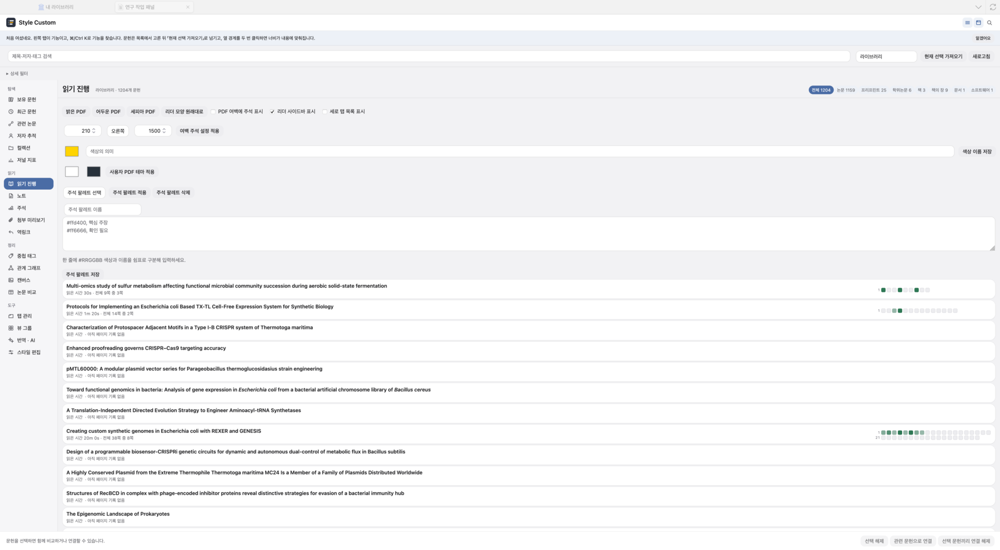

# Zotero plugins: ZotPoP and Style Custom

Zotero 7·8·9용 플러그인 두 개입니다. 하나의 저장소에서 따로 설치합니다.

| 플러그인 | 하는 일 | 최신 |
|---|---|---|
| **ZotPoP** | Publish or Perish 방식의 논문 검색과 가져오기. 저자·저널·제목·키워드·연도로 찾고, 인용 수와 h-index 같은 지표를 보면서 골라 Zotero에 넣습니다. | [zotpop-0.38.0.xpi](https://github.com/JAEYOONSUNG/zotero-plugins/releases/download/zotpop-v0.38.0/zotpop-0.38.0.xpi) |
| **Style Custom** | 연구 작업 패널. 보유 문헌, 관련 논문, 저자 추적, JCR 저널 지표, 주석·노트, 관계 그래프, 읽기 기록을 Zotero 안에서 한 번에 봅니다. 문헌 목록에는 IF·인용 수·읽기 시간·저널 표시 열이 추가됩니다. | [style-custom-0.51.3.xpi](https://github.com/JAEYOONSUNG/zotero-plugins/releases/download/style-custom-v0.51.3/style-custom-0.51.3.xpi) |


둘 다 한국어와 영어를 지원합니다. 설정에서 언어를 바꿀 수 있습니다. [English summary below.](#in-english)

## 설치

1. 위 표의 `.xpi` 파일을 내려받습니다.
2. Zotero에서 **도구 → 부가 기능**을 엽니다.
3. 오른쪽 위 톱니바퀴 → **Install Add-on From File…** 에서 내려받은 파일을 고릅니다.
4. Zotero를 다시 시작합니다. 아이템 툴바에 위 그림의 버튼 두 개가 나타납니다.

새 버전은 Zotero의 부가 기능 업데이트로 받습니다. 요구 사항은 Zotero 7 이상이며, 9.0에서 개발·검증했습니다.

### 처음에 넣어 두면 좋은 것 (선택)

모두 없어도 동작합니다. 설정 → 각 플러그인 페이지에 있습니다.

| 항목 | 효과 | 어디서 |
|---|---|---|
| OpenAlex API 키 | 인용 수·저널 정보·저자 추적의 하루 한도가 약 100배로 늘어남 | [openalex.org](https://openalex.org) 무료 |
| 연락 이메일 | OpenAlex·Crossref의 빠른 대기열(polite pool) 사용. 요청마다 두 서비스 서버 기록에 남음 | 본인 주소 |
| Publish or Perish 실행 파일 | ZotPoP에서 Google Scholar 검색 | [harzing.com/pop](https://harzing.com/resources/publish-or-perish) |
| AI 서버 주소·모델 | Style Custom의 번역·요약·논문 비교 | OpenAI 호환 Chat Completions 엔드포인트 |
| easyScholar 키, USPTO 키 | CAS 등 추가 저널 등급, 관심 저자의 특허 | 각 서비스 무료 키 |

---

## ZotPoP

아이템 툴바의 **돋보기** 버튼이나 **도구 → ZotPoP — 논문 찾기…** 로 엽니다. 문헌을 우클릭하고 **Style Custom → ZotPoP에서 이 논문 검색**을 누르면 그 논문의 제목·저자·연도가 채워진 채 열립니다.


### 검색

- **검색 소스**: 통합 검색(OpenAlex + Crossref + Europe PMC + arXiv), OpenAlex, Crossref, PubMed, Europe PMC, Semantic Scholar, arXiv, 프리프린트, Google Scholar(Publish or Perish 엔진 필요).
- **조건**: 저자, 저널, 제목 단어, 키워드(전체 필드), 연도 범위, 최대 결과(최대 2,000), 정렬. Boolean 식(`AND`, `OR`, `NOT`, 괄호, 따옴표)은 모든 소스에서 같은 뜻으로 변환됩니다.
- **결과 표**: 인용 수, 연간 인용, 순위, 저자, 제목, 연도, 저널(저널 색 표시), IF, 1저자 기관과 국가, 기관 티어, DOI, PDF 유무, 내 서재 보유 여부. 열 너비와 순서는 기억됩니다. 긴 셀은 마우스를 올리면 한 번 흘러갑니다.
- **인용 지표** (왼쪽): 출판 연도 범위, 논문 수, 총 인용, h-index, g-index, hI,norm, hI,annual, hA-index. 필터를 적용하면 보이는 결과 기준으로 다시 계산됩니다.
- **최근 검색**: 마지막 검색은 디스크에 남아 다음에 열 때 그대로 복원됩니다. 중간에 멈춘 검색은 미완료로 표시됩니다.

### 가져오기

행의 체크박스나 스페이스바로 고르고 **선택 항목 가져오기**를 누릅니다. 메타데이터는 Zotero 번역기로, PDF는 가능한 경우 자동으로 붙습니다. 이미 있는 논문은 건너뛰고, 원하면 인용 수를 Extra 필드에 적습니다. **미리보기**(P)는 첫 페이지를 별도 창에서 보여 줍니다. CSV 복사·저장도 있습니다.

### 저자 검색 탭

이름, ORCID, Google Scholar 프로필 URL·ID로 저자를 찾아 그 사람의 논문 목록을 불러옵니다. Google이 Scholar **프로필 검색**에는 로그인을 요구하므로, 로그인 없이 누르면 같은 이름으로 Scholar **논문 검색**을 대신 실행하고 그 사실을 배너에 적습니다. 프로필 자체가 필요하면 Publish or Perish 앱에서 Google Scholar에 로그인한 뒤 다시 누르세요.

### 키보드

↑/↓ 이동, Space 선택, Enter 열기, ⌘F 결과 필터, ⌘A 전체 선택, Esc 중지·닫기.

---

## Style Custom

아이템 툴바의 **패널** 버튼, **도구 → Style Custom 연구 작업 패널**, 또는 문헌 우클릭 메뉴로 엽니다. 패널은 떠 있는 창으로도, Zotero 탭 안에 도킹해서도 씁니다(오른쪽 위 버튼). ⌘/Ctrl K 로 기능을 이름으로 찾습니다.

### 문헌 목록의 열

설치하면 문헌 목록에 열이 추가됩니다: **IF**(JCR 2025 JIF), **인용 수**, **읽기 시간**, **상태**(안 읽음·읽는 중·읽음), **별점**, **저널 표시**(저널마다 고유한 색과 약어), **1저자 기관**과 국가, **파일 종류**. 우클릭 → **커스텀 열로 전환**이 한 번에 켭니다. **열 경계를 두 번 클릭**하면 그 열이 내용 너비에 맞춰집니다.

### 우클릭 메뉴 (문헌 → Style Custom)

읽음 상태와 별점, ZotPoP에서 검색, 이 논문의 관련 논문, 이 논문 책임저자 추적, 인용 형식으로 복사, 관계 그래프 열기, 인용 수·저널 지표 새로고침, 철회·공개접근 확인, 빈 칸 채우기(OpenAlex에서 분야·h-index·OA 정보), 라이브러리 전체 인용 수 조회.

### 탭

**보유 문헌** — 서재 전체나 선택·컬렉션 범위를 한 줄씩. 제목·저자·태그 검색, 유형·태그·상태·별점·연도 필터, 종류별 칩(논문·프리프린트·학위논문·책·특허·데이터셋). 항목을 골라 관련 문헌으로 연결하거나 비교표로 보냅니다.


**관련 논문** — 고른 논문을 인용한 논문, 그 논문이 인용한 문헌, 주제가 가까운 논문을 OpenAlex에서 찾아 세 묶음으로 보여 줍니다. 서재에 없는 논문은 바로 ZotPoP로 찾거나 가져옵니다.

**저자 추적** — 논문의 저자를 찾아 최근 논문, 소속, h-index, 주제를 봅니다. **관심 저자로 등록**하면 새 논문, 소속 이동, 새 공저자, (키가 있으면) 특허 출원을 한 번에 확인합니다. 우클릭 메뉴의 **책임저자 추적**은 마지막 저자를 바로 엽니다.

**저널 지표** — Clarivate JCR의 **그룹 → 카테고리 → 저널** 계층을 그대로 탐색합니다. 카테고리마다 저널 수·인용 가능 항목·총 인용·JIF 중앙값, 저널마다 JIF·카테고리 내 순위·Q·백분위. **OpenAlex 주제로 탐색**으로 바꾸면 22,594종 저널을 대분류 › 분야 › 세부 분야로 걸러 보고, 내 서재의 저널만 보거나 전체를 봅니다.


**주석** — 선택한 PDF들의 하이라이트와 메모를 한 화면에서 읽습니다. 색으로 거르고, 여러 주석을 골라 색을 바꾸거나 하나로 합치거나 출처 링크가 있는 노트로 만듭니다. 각 주석에 메모를 바로 씁니다.


**관계 그래프** — 서재 안 논문들의 인용 관계, 관련 문헌 연결, 공통 태그, 공통 저자를 그래프로 봅니다. 저널 색으로 칠해지고, 마우스를 올리면 이웃이 앞으로 나옵니다.


**컬렉션** — 컬렉션 트리와 각 컬렉션이 담은 양을 막대로. 빈 컬렉션 숨기기, 이름 검색.

**읽기 진행** — PDF를 읽은 시간과 페이지가 자동으로 기록됩니다. 어느 쪽을 얼마나 읽었는지 페이지 지도로 보고, 한 번도 안 읽은 논문을 고릅니다.



**노트·역링크·첨부 미리보기·중첩 태그·캔버스·논문 비교·탭 관리·뷰 그룹·번역 · AI·스타일 편집** — 노트 작성과 휴지통 이동, 이 문헌을 가리키는 노트, 첨부 미리보기, 태그 계층, 자유 배치 캔버스, 여러 논문의 비교표(AI가 주장과 논쟁 지점을 읽어 줌), 열린 탭 정리, 저장된 보기 묶음, 번역·요약, 패널과 목록의 색·글꼴.

### 설정

설정 → Style Custom. 맨 위 **먼저 할 것**에 아직 비어 있는 키 세 개가 보입니다. 열 표시, 인용 수 조회 시점, 읽기 기록, 저널 색, AI 프롬프트, 언어까지 모두 여기서 바꿉니다. 각 항목에 설명이 붙어 있습니다.

### 자체 점검

설치 후 Zotero가 켜질 때 실제 서재를 상대로 36개 항목을 점검해 `Zotero 데이터 폴더/style-custom-selfcheck.json`에 남깁니다. 어떤 창도 열지 않습니다.

---

## 데이터 출처

| 출처 | 쓰이는 곳 |
|---|---|
| Clarivate Journal Citation Reports 2026 (JIF 2025) | 저널 IF, 사분위, 카테고리, 순위 |
| OpenAlex | 인용 수, 저자·기관, 저널 프로필과 주제 분류, 관련 논문 |
| Crossref, Europe PMC, PubMed, Semantic Scholar, arXiv | ZotPoP 검색, 인용 수 대조 |
| Publish or Perish (Harzing) | Google Scholar 검색 엔진 |
| USPTO Open Data Portal | 관심 저자의 특허 (키 필요) |

이메일 주소나 API 키는 사용자가 설정에 직접 넣은 것만, 해당 서비스에만 보냅니다.

## 개발

```
# 테스트 (각 디렉터리에서)
node --test --test-force-exit test/*.test.mjs
cd zotero-style-custom && node --test --test-force-exit test/*.test.mjs

# 빌드
sh scripts/build.sh                      # build/zotpop-<version>.xpi
cd zotero-style-custom && python3 scripts/build.py   # build/style-custom-<version>.xpi
```

ZotPoP의 자세한 문서는 [docs/ZOTPOP.md](docs/ZOTPOP.md), Style Custom은 [zotero-style-custom/README.md](zotero-style-custom/README.md)에 있습니다. 개선 기록은 [zotero-style-custom/docs/improvement-rounds.json](zotero-style-custom/docs/improvement-rounds.json)에 라운드별로 남습니다. 라이선스 고지는 각 디렉터리의 `LICENSES.md`에 있습니다.

---

## In English

Two plugins for Zotero 7, 8 and 9, installed separately from this one repository. Both speak English and Korean; switch in each plugin's settings.

**ZotPoP** is a Publish or Perish-style search-and-import window inside Zotero. Search OpenAlex, Crossref, PubMed, Europe PMC, Semantic Scholar, arXiv, preprint servers, a combined index of four of them, or Google Scholar through an installed Publish or Perish engine. Filter by author, journal, title words, keywords, years; read citation counts, journal impact factor, first-author institution and tier in the result table and h-, g-, hI-indexes in the sidebar; tick the papers you want and add them to your library with metadata from Zotero's translators and the PDF fetched when available. An author tab finds people by name, ORCID or Scholar profile.

**Style Custom** is a research workbench: a panel, floating or docked in a Zotero tab, with tabs for your library, related papers (citing, cited, similar, from OpenAlex), author tracking (new papers, moves, new coauthors, patents), Clarivate JCR journal metrics browsed by group → category → journal or by OpenAlex subject, annotations across PDFs, notes, a citation graph, collections, reading progress recorded from the PDF reader, a comparison table, translation and AI summaries. It also adds columns to the item list (impact factor, citations, reading time, status, rating, journal mark, first-author institution) and a right-click menu; double-clicking a column edge fits it to its content.

**Install**: download the `.xpi` from the table at the top, then in Zotero open Tools → Add-ons → gear → *Install Add-on From File…* and restart. Updates arrive through Zotero's add-on updater. Optional keys (OpenAlex, easyScholar, USPTO), a contact email for the polite pools, the Publish or Perish executable and an OpenAI-compatible endpoint for the AI features are entered in each plugin's settings; nothing is sent anywhere unless you enter it.
