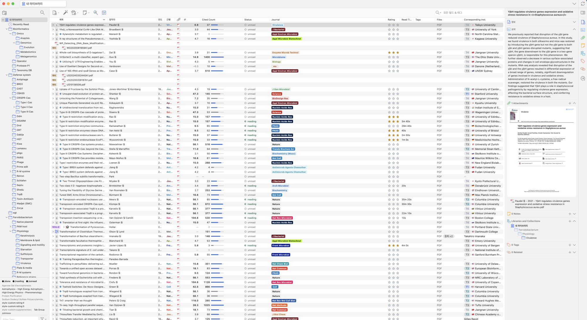
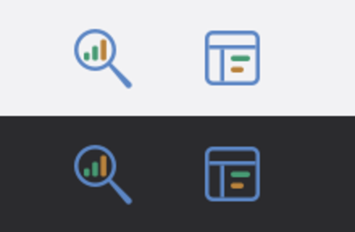
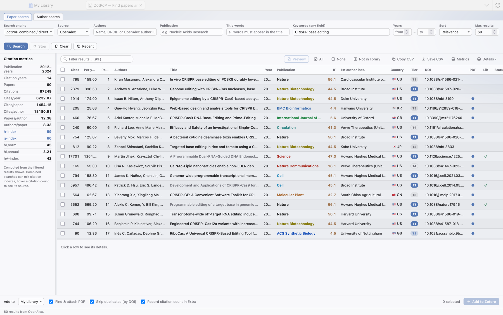
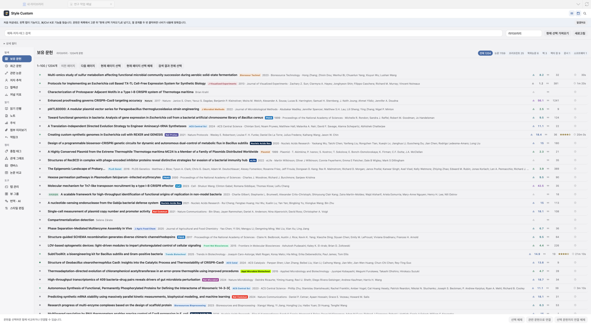
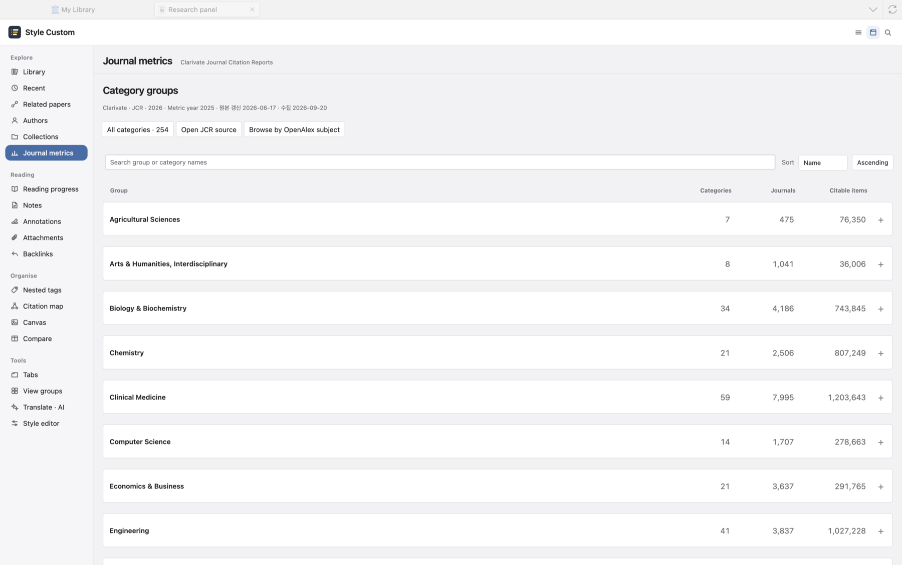
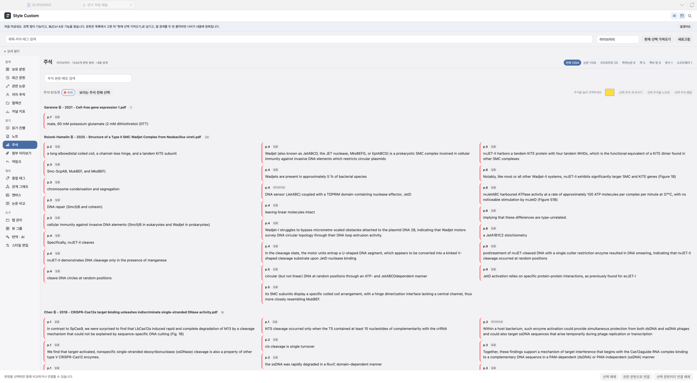
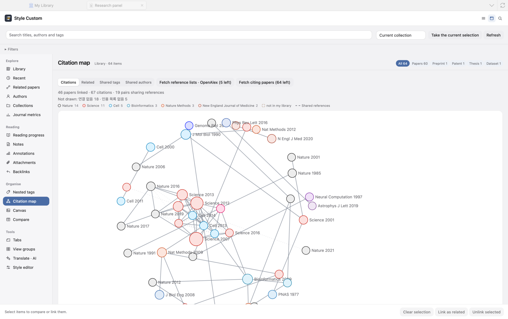
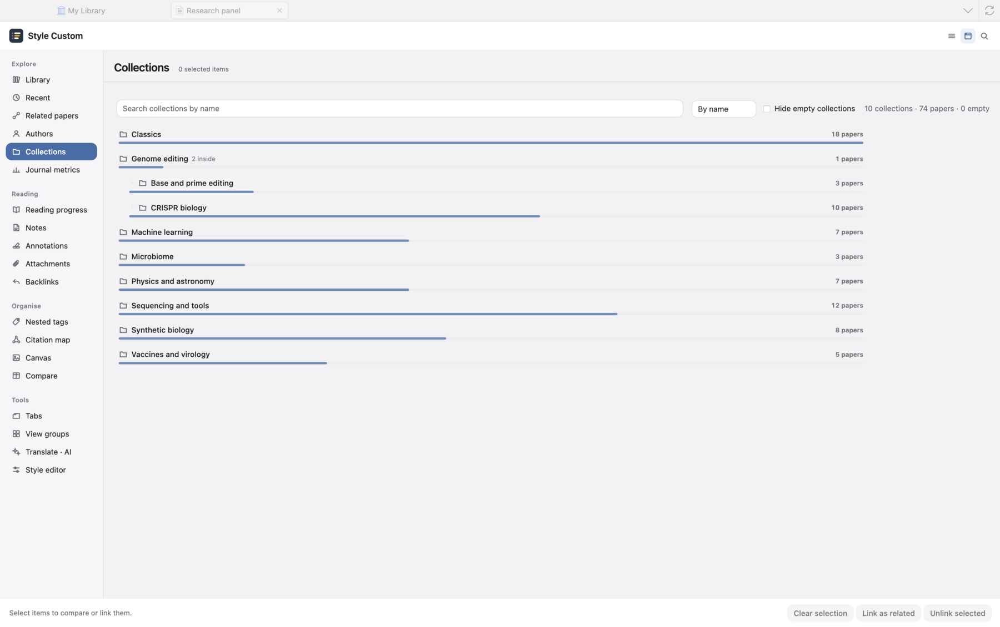

# Zotero plugins: ZotPoP and Style Custom

Two plugins for Zotero 7, 8 and 9, kept in one repository and installed separately.

| Plugin | What it does | Latest |
|---|---|---|
| **ZotPoP** | Search and import. Find papers by author, journal, title, keywords and years across several indexes, read citation counts and h-index-style metrics while you choose, and add the papers to your library. | [zotpop-0.38.3.xpi](https://github.com/JAEYOONSUNG/zotero-plugins/releases/download/zotpop-v0.38.3/zotpop-0.38.3.xpi) |
| **Style Custom** | A research workbench inside Zotero: your library, related papers, author tracking, JCR journal metrics, annotations and notes, a citation graph and reading progress in one panel, plus impact factor, citation, reading-time and journal-mark columns in the item list. | [style-custom-0.51.18.xpi](https://github.com/JAEYOONSUNG/zotero-plugins/releases/download/style-custom-v0.51.18/style-custom-0.51.18.xpi) |



The item list above is Zotero's own, with Style Custom's columns switched on. Every picture on this page is of a demonstration library of well-known public papers. Both plugins are available in English and Korean; the language is chosen in each plugin's settings.



## Install

1. Download the `.xpi` from the table above.
2. In Zotero, open **Tools → Add-ons**.
3. Click the gear at the top right → **Install Add-on From File…** and choose the downloaded file.
4. Restart Zotero. The two buttons shown above appear in the items toolbar.

New versions install themselves. While Zotero is open, each plugin checks this repository's release list once a day, downloads a newer release, verifies it against the hash in the feed and applies it without a restart; Zotero's own add-on updater reads the same feed. The check can be turned off, and run by hand, in each plugin's preferences pane (ZotPoP → **Updates**; Style Custom → **업데이트 / Updates**). Zotero 7 or later is required; development and verification were done on Zotero 9.0.

### Worth entering at the start (all optional)

Everything works without these. They live in Settings → the plugin's page.

| Item | Effect | Where from |
|---|---|---|
| OpenAlex API key | Raises the daily allowance for citation counts, journal facts and author tracking about a hundredfold | [openalex.org](https://openalex.org), free |
| Contact email | Puts OpenAlex and Crossref requests in their faster "polite pool". The address is recorded by those two services on every request | your own address |
| AI endpoint and model | Translation, summaries and paper comparison in Style Custom | any OpenAI-compatible Chat Completions endpoint |
| easyScholar key, USPTO key | Further journal grades such as CAS; patents filed by followed authors | free keys from each service |

---

## ZotPoP

Open it from the **magnifier** button in the items toolbar or **Tools → ZotPoP — Find papers…**. Right-click a paper and choose **Style Custom → Search this paper in ZotPoP** to open it with the paper's title, authors and year already filled in.



### Searching

- **Sources**: a combined index (OpenAlex + Crossref + Europe PMC + arXiv), OpenAlex, Crossref, PubMed, Europe PMC, Semantic Scholar, arXiv, preprint servers, and Google Scholar (Scholar may ask for a CAPTCHA).
- **Criteria**: authors, journal, title words, keywords in any field, a year range, a maximum number of results (up to 2,000) and a sort order. Boolean expressions (`AND`, `OR`, `NOT`, parentheses, quoted phrases) mean the same thing in every source.
- **The result table**: citations, citations per year, rank, authors, title, year, journal (in the journal's own colour), impact factor, first author's institution and country, institution tier, DOI, whether a PDF is available and whether the paper is already in your library. Column widths and order are remembered. A cell whose text overflows scrolls once while the pointer rests on it.
- **Citation metrics** (left): the span of publication years, paper count, total citations, h-index, g-index, hI,norm, hI,annual and hA-index, recomputed for whatever the filter leaves visible.
- **Recent searches**: the last search is kept on disk and restored the next time the window opens. A search that was stopped part-way is marked incomplete.

### Importing

Tick rows with the checkbox or the space bar and press **Add selected**. Metadata comes through Zotero's own translators and the PDF is attached when one can be fetched. Papers already in the library are skipped, and citation counts can be written to the Extra field if you want them. **Preview** (P) shows the first page in a separate window. The table can be copied or saved as CSV.

### The author tab

Find a person by name, ORCID, or Google Scholar profile URL or ID and load their publication list. Google requires a signed-in account for Scholar *profile* search, so a profile lookup without one runs a Scholar *paper* search by the same name instead and says so in a banner.

### Keyboard

↑/↓ move, Space select, Enter open, ⌘F filter the results, ⌘A select all, Esc stop or close.

---

## Style Custom

Open it from the **panel** button in the items toolbar, **Tools → Style Custom research panel**, or a paper's right-click menu. The panel works as a floating window or docked into a Zotero tab (the button at its top right). ⌘/Ctrl K finds any feature by name.

### Columns in the item list

Installing adds columns to the item list, as in the picture at the top of this page: **IF** (JCR 2025 impact factor), **Cited count** with a bar against the library's most-cited paper, **Status** (unread, reading, read) with a half-filled circle while a paper is being read, **Journal** as a mark in the journal's own colour, **Rating** as stars you can click, **Read time** recorded from the PDF reader, **Files** (PDF, supplementary, duplicates), and **Corresponding institution** with its tier and country flag. Patents and theses are labelled as such. Right-click → **Switch to custom columns** turns them on together; the column header's own menu shows or hides each one. **Double-click a column's right edge** to fit that column to its content, as in a spreadsheet.

### The right-click menu (item → Style Custom)

Reading status and rating; search this paper in ZotPoP; related papers; follow the senior author; copy in a citation style; open the citation graph; refresh citations and journal metrics; check retractions and open access; fill the gaps (subject, h-index and open-access facts from OpenAlex); look up citations for the whole library.

### Tabs

**Library** — the whole library or the selection or a collection, one line per paper. Search by title, author or tag; filter by type, tag, status, rating and year; chips for each kind (papers, preprints, theses, books, patents, datasets). Pick papers to link as related or send to the comparison table.



**Related papers** — for one paper, the papers that cite it, the works it cites, and papers close to it in subject, from OpenAlex, in three groups. A paper you do not hold can be found or imported through ZotPoP from its row.

**Authors** — the authors of a paper with their recent work, affiliation, h-index and topics. **Follow** someone and one check reports their new papers, moves between institutions, first-time coauthors and, with a USPTO key, patent filings. The right-click entry **Follow the senior author** opens the last-listed author directly.

**Journal metrics** — Clarivate JCR browsed as it is organised: **groups → categories → journals**. Each category shows its journal count, citable items, total citations and median JIF; each journal its JIF, rank within the category, quartile and percentile. **Browse by OpenAlex subject** switches to 22,594 journals filtered by domain › field › subfield, for the journals in your library or all of them.



**Annotations** — the highlights and notes of the selected PDFs on one screen. Filter by colour; select several to recolour them, merge them, or turn them into a note with links back to the source. A memo can be written on any annotation in place.



**Citation graph** — the papers in your library as a graph: citation links, related-item links, shared tags or shared authors. Nodes take their journal's colour; hovering brings a paper's neighbourhood forward.



**Collections** — the collection tree with a bar for what each one holds; hide empty collections, search by name.



**Reading** — time and pages read in the PDF reader are recorded automatically. A page map shows which pages were read and for how long; unread papers can be picked out.

**Notes, backlinks, attachment preview, nested tags, canvas, comparison, tabs, view groups, translation · AI, appearance** — write notes and send them to the trash, see the notes that point at a paper, preview attachments, browse tags as a hierarchy, arrange papers on a free canvas, compare several papers in a table (the AI reads their claims and points of contention), tidy open tabs, keep saved sets of views, translate and summarise, and set the panel's and the list's colours and fonts.

### Settings

Settings → Style Custom. A **Start here** block at the top lists the three keys still blank. Column display, when citations are looked up, reading records, journal colours, AI prompts and the language are all here, each with an explanation.

### Self-check

After an install, when Zotero starts, 36 checks run against the real library and their report is written to `<Zotero data folder>/style-custom-selfcheck.json`. No window is opened.

---

## Data sources

| Source | Used for |
|---|---|
| Clarivate Journal Citation Reports 2026 (JIF 2025) | Journal impact factor, quartile, category, rank |
| OpenAlex | Citation counts, authors and institutions, journal profiles and subject classification, related papers |
| Crossref, Europe PMC, PubMed, Semantic Scholar, arXiv | ZotPoP search, citation cross-checks |
| Google Scholar | Scholar search and author profiles |
| USPTO Open Data Portal | Patents of followed authors (key required) |

Email addresses and API keys are sent only to the service they belong to, and only if you entered them yourself.

## Development

```
# tests, in each directory
node --test --test-force-exit test/*.test.mjs
cd zotero-style-custom && node --test --test-force-exit test/*.test.mjs

# build
sh scripts/build.sh                                   # build/zotpop-<version>.xpi
cd zotero-style-custom && python3 scripts/build.py    # build/style-custom-<version>.xpi
```

Style Custom's reference is [zotero-style-custom/README.md](zotero-style-custom/README.md). Every improvement round of Style Custom is recorded in [zotero-style-custom/docs/improvement-rounds.json](zotero-style-custom/docs/improvement-rounds.json). Third-party notices are in each directory's `LICENSES.md`.
