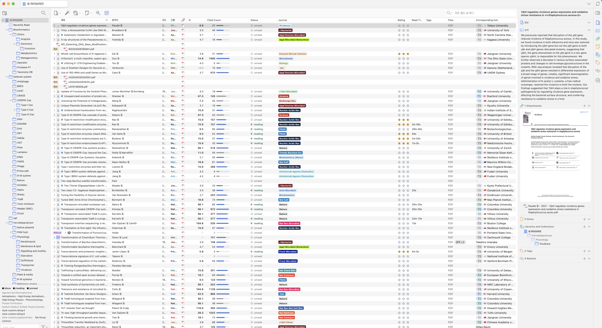
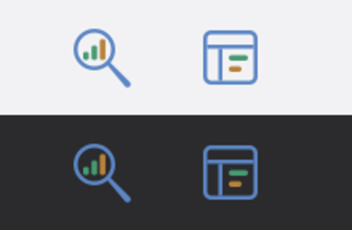
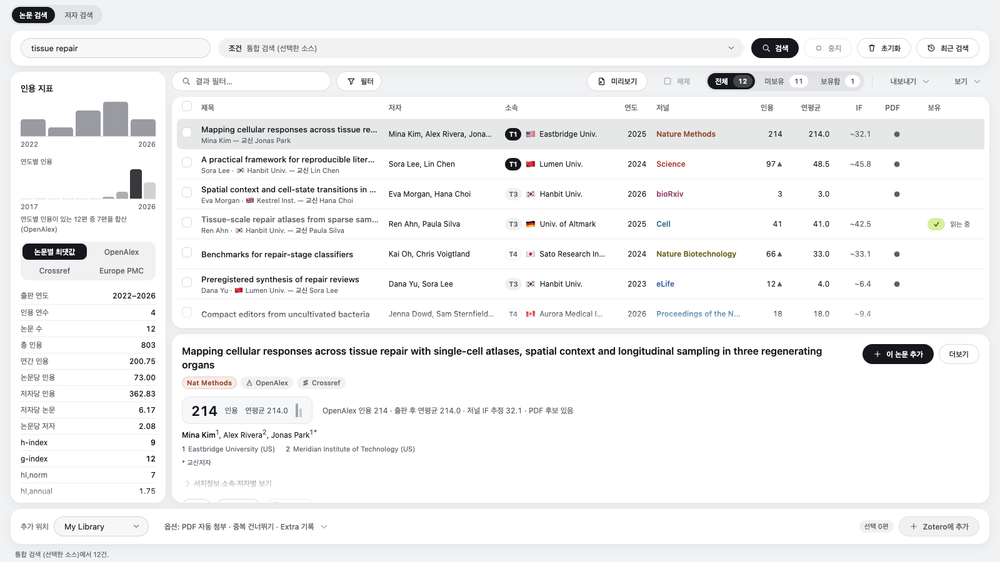
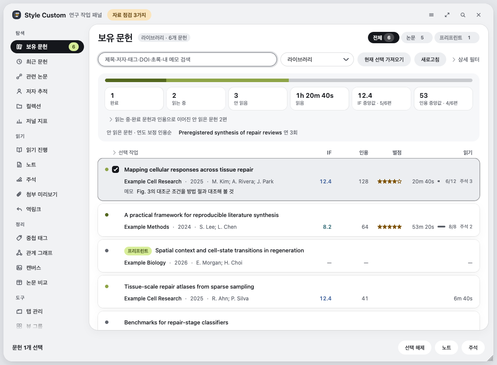
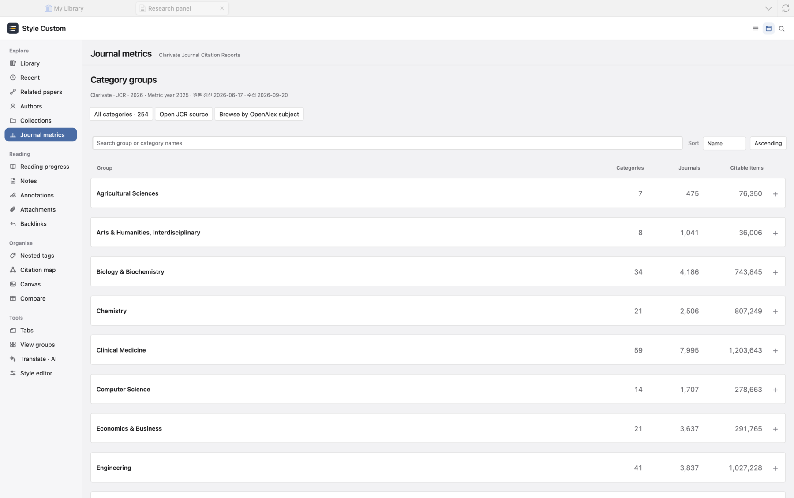
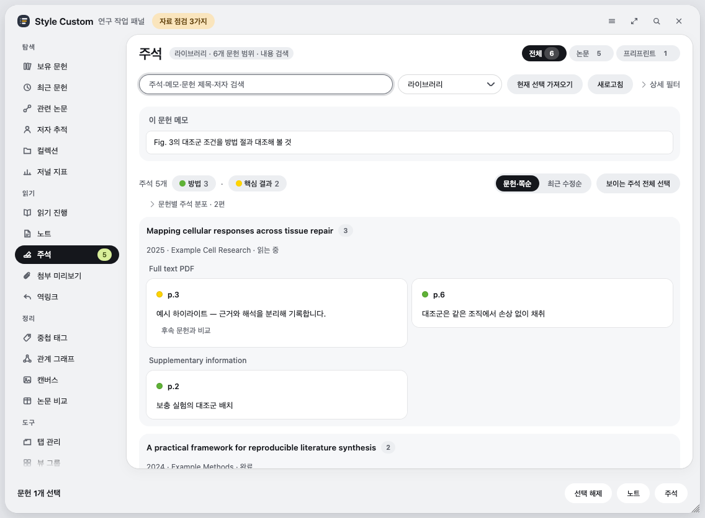
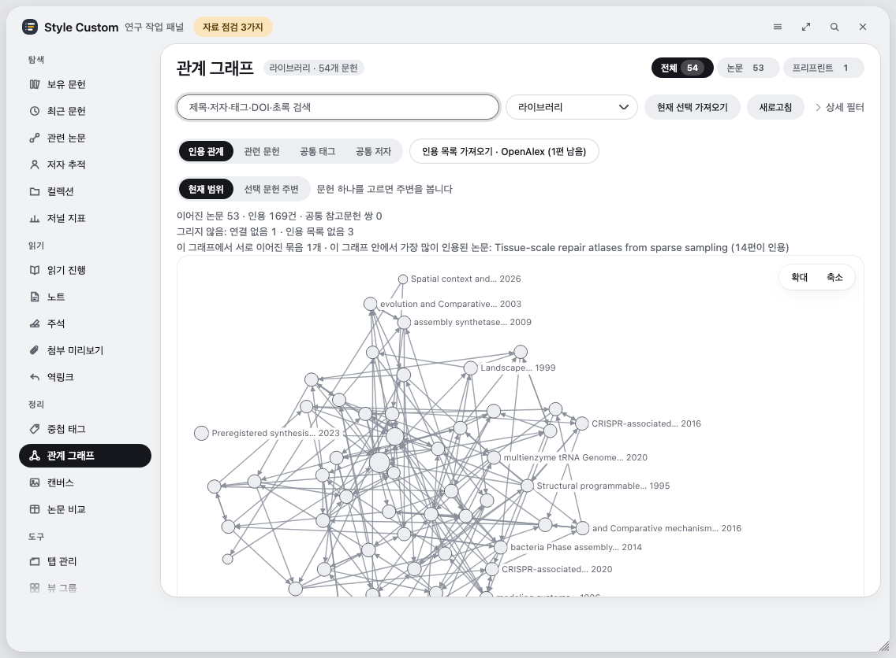
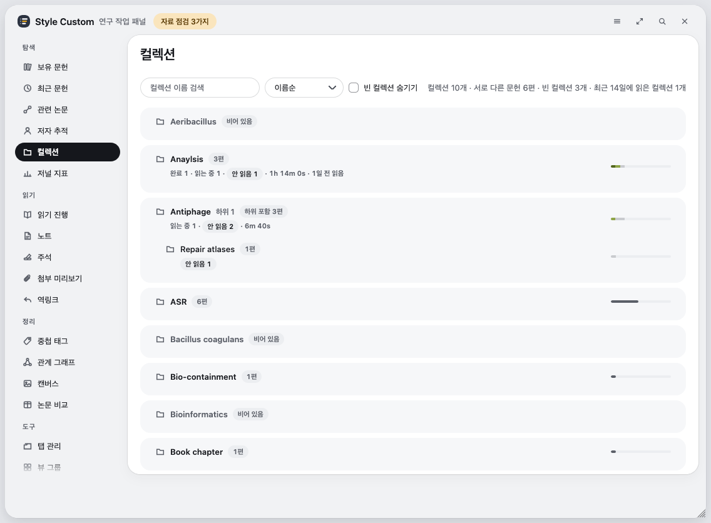

# Zotero plugins: ZotPoP and Style Custom

Two plugins kept in one repository and installed separately. ZotPoP: Zotero 7–9. Style Custom: Zotero 9 (9.0–9.*).

| Plugin | What it does | Latest |
|---|---|---|
| **ZotPoP** | Search and import. Find papers by author, journal, title, keywords and years across several indexes, read citation counts and h-index-style metrics while you choose, and add the papers to your library. | [zotpop-0.55.0.xpi](https://github.com/JAEYOONSUNG/zotero-plugins/releases/download/zotpop-v0.55.0/zotpop-0.55.0.xpi) |
| **Style Custom** | A research workbench inside Zotero: your library, related papers, author tracking, journal metrics, annotations and notes, a citation graph and reading progress in one panel, plus journal-metric, citation, reading-time and journal-mark columns in the item list. | [style-custom-0.59.30.xpi](https://github.com/JAEYOONSUNG/zotero-plugins/releases/download/style-custom-v0.59.30/style-custom-0.59.30.xpi) |



The item list above is Zotero's own, with Style Custom's columns switched on. Every picture on this page is of a demonstration library of well-known public papers. Both plugins are available in English and Korean, and **English is the default**. Anyone who has already chosen a language keeps it. The language is set in each plugin (see **Language** below): English, 한국어, or Follow Zotero, which uses Korean only when Zotero itself is in Korean.



## Install

1. Download the `.xpi` from the table above.
2. In Zotero, open **Tools → Add-ons**.
3. Click the gear at the top right → **Install Add-on From File…** and choose the downloaded file.
4. Restart Zotero. The two buttons shown above appear in the items toolbar.

New versions install themselves. While Zotero is open, each plugin checks this repository's release list once a day, downloads a newer release, verifies it against the hash in the feed and applies it without a restart; Zotero's own add-on updater reads the same feed. The check can be turned off, and run by hand, in each plugin's preferences pane (ZotPoP → **Updates**; Style Custom → **Updates**). ZotPoP runs on Zotero 7–9; Style Custom only loads on Zotero 9 (9.0–9.*). Development and verification were done on Zotero 9.0.

### Worth entering at the start (all optional)

Everything works without these. They live in Settings → the plugin's page.

| Item | Effect | Where from |
|---|---|---|
| OpenAlex API key | Raises the daily allowance for citation counts, journal facts and author tracking about a hundredfold. With a key, Style Custom also looks up the citations of the rows you see in the item list on its own; without one it does not | [openalex.org](https://openalex.org), free |
| Contact email | Puts Crossref requests in its faster "polite pool". The address is also sent to OpenAlex (which no longer gives a speed benefit for it) and, from ZotPoP, to NCBI PubMed and to Unpaywall when a PDF is looked up on import. Each service records it. Style Custom has its own field and falls back to ZotPoP's address; with neither, nothing is sent | your own address |
| AI endpoint and model | Translation, summaries and paper comparison in Style Custom (its settings page). ZotPoP's abstract translation can use an endpoint too, but that has no settings page: enter it in Zotero's config editor (`extensions.zotpop.aiEndpoint`, `aiModel`, `aiKey`) | any OpenAI-compatible Chat Completions endpoint |
| Altmetric API key | Altmetric attention counts beside a paper's Bluesky, Hacker News and Wikipedia reception | [altmetric.com](https://www.altmetric.com) |
| easyScholar key, USPTO key | Further journal grades such as CAS; patents filed by followed authors | free keys from each service |

---

## ZotPoP

Open it from the **magnifier** button in the items toolbar or **Tools → ZotPoP — Find papers…**. Right-click a paper and choose **Style Custom → Search this paper in ZotPoP** to open it with the paper's title, authors and year already filled in.



### Searching

- **Sources**: a combined index (OpenAlex + Crossref + Europe PMC + arXiv), OpenAlex, Crossref, PubMed, Europe PMC, Semantic Scholar, arXiv, preprint servers (OSF Preprints, plus bioRxiv, medRxiv and other servers through Crossref and Europe PMC records), and Google Scholar (Scholar may ask for a CAPTCHA).
- **Criteria**: authors, journals (type a name, an ISO abbreviation such as *Nat Methods* or an acronym such as *PNAS* and pick from the list; several journals can be chosen at once), title words, keywords in any field, a year range, a maximum number of results (up to 2,000) and a sort order. Boolean expressions (`AND`, `OR`, `NOT`, parentheses, quoted phrases) are understood by OpenAlex, PubMed, Europe PMC, arXiv and the combined index. Crossref and OSF cannot evaluate them, so ZotPoP fetches a wider set and applies your expression to titles and abstracts afterwards (missing metadata limits coverage). Semantic Scholar refuses them and says so; Google Scholar reads the text as Google does.
- **The result table**: citations (with ▲/▼ against the previous year), citations per year (citations ÷ years since publication, the publication year counting as one), rank, authors, title, year, journal (in the journal's own colour), impact factor, a **소속** column with the institution's tier (T1 at an OpenAlex h-index of 2000 or more, T2 1400, T3 400, T4 below; the same cut-points as Style Custom), flag and name, DOI, whether a PDF is available and whether the paper is already in your library. Under each title the first and corresponding authors are named. The title column takes whatever width the other columns leave. Column widths and order are remembered.
- **Hover cards**: resting the pointer on a title, an institution, a journal or the authors opens a card with the full details — the whole title, journal, year and citations, every author, and each institution with its country, h-index band and the author it belongs to.
- **Filters**: a **필터** button sets rules that include or exclude by words (in any field or a chosen one), authors, journals, institutions, countries, document type, source, year range, citations, citations per year, impact factor, PDF availability and whether you already hold the paper — each with live counts. The filter box also takes a short syntax: `-word`, `"exact phrase"`, `journal:Cell`, `-author:Kim`, `inst:Harvard`, `country:KR`, `year:2018-2022`.
- **Citation metrics** (left): a histogram of publication years (long spans are grouped), the year-by-year citations of the whole result set, the paper count, total citations, h-index, g-index, hI,norm, hI,annual and hA-index, recomputed for whatever the filter leaves visible.
- **A paper's citations over time**: the detail card shows the citation count large with a ten-year sparkline. Clicking it opens the citations per year, this year against the last two, the change from the year before, the peak year, and how many citations arrived since you last looked at the paper (one OpenAlex request, cached for six hours). With Style Custom installed, selecting a paper also loads its reference list (one OpenAlex request, cached) for the 내 문헌 signals: whether it cites, or is cited by, papers in your library.
- **Abstract translation**: **번역** in the detail card translates the abstract (and, if ticked, the title) into the language you choose, through the installed *Translate for Zotero* plugin and the service already set up there; an OpenAI-compatible endpoint can be used instead.
- **Recent searches**: the last 30 searches that returned results are kept on disk with those results, so reopening one asks no API again; the same query run again replaces its earlier entry. A search that was stopped part-way is marked incomplete. **Pinned searches** stay at the top, are not removed by clearing the history, keep the results already seen, and show how many are new (**새 결과 n**) when you run them again; nothing runs in the background.

- **Rank by my library**: a button that, only when you press it, scores each result by how it is linked to the papers you hold (score = 3 × (papers of yours it cites + papers of yours that cite it) + shared references weighted by how specific each is, so a reference cited by nearly all your papers counts about 0). The list is sorted by that score, each row shows a breakdown chip (cites yours, cited by yours, shared references) and the held papers involved; results you already hold, or the other version of one, are flagged and left out of the ranking. It needs one OpenAlex lookup per 50 held papers (reference lists are cached for 30 days, so a second run asks almost nothing), can be cancelled, and sorts back when you press it again. Nothing runs unasked.

### Importing

Tick rows with the checkbox or the space bar and press **Add selected**. Metadata comes through Zotero's own translators and the PDF is attached when one can be fetched. Papers already in the library are skipped, and citation counts are written to the Extra field by default (untick the option to stop). **Preview** (P) shows the PDF inside the detail card, with page turning; no window opens. The table can be copied or saved as CSV.

### The author tab

The default author registry is **Combined (OpenAlex + ORCID)**: type a name, an ORCID iD or an OpenAlex ID, and people found in both are merged into one card; picking a card loads all their papers. Registries for ORCID alone and for Google Scholar are also offered. A name search that cannot tell namesakes apart asks you to pick the person (grouped by name form, co-authors and ids) before any metric is computed, and each paper can be put in or out afterwards. Each card has a **LinkedIn** button (the profile on the person's ORCID record, otherwise a LinkedIn search by name and institution; nothing is fetched from LinkedIn), and a profile summary read from ORCID. For a Scholar profile, its own *Cited by* table (All and Since) is shown on top, Scholar's counts are the default, and a note says how many of the profile's papers the figures are computed from and why they differ from other indexes. Google requires a signed-in account for Scholar *profile* search, so a profile lookup without one runs a Scholar *paper* search by the same name instead and says so in a banner.

### Keyboard

↑/↓ move, Space select, Enter open, ⌘F filter the results, ⌘A select all, Esc stop or close.

---

## Style Custom

Open it from the **panel** button in the items toolbar, **Tools → Style Custom → Research panel**, or a paper's right-click menu. The panel works as a floating window or docked into a Zotero tab (the button at its top right). ⌘/Ctrl K finds any feature by name.

### Columns in the item list

Installing adds columns to the item list, as in the picture at the top of this page: **IF** (a Journal Impact Factor only for journals in your own JCR export or among the 86 publisher-page figures that ship; other journals are blank here, and OpenAlex's 2-year mean citedness, which is not a JIF, has its own **OA 2-yr mean citedness** column), **Cited count** with a bar against the library's most-cited paper, **Status** (unread, reading, read) with a half-filled circle while a paper is being read, **Journal** as a mark in the journal's own colour, **Rating** as stars you can click, **Read time** recorded from the PDF reader, **Files** (PDF, supplementary, duplicates), and **Corresponding institution** with its tier and country flag. Patents and theses are labelled as such. Right-click → **Switch to custom columns** turns them on together; the column header's own menu shows or hides each one. **Double-click a column's right edge** to fit that column to its content, as in a spreadsheet.

Beyond the columns themselves:

- **⋯ column** — a narrow column at the right whose button opens the same menu as a right-click on that row (it opens a menu, never a window).
- **Hover tint and outline** — the column under the pointer is tinted and the cell itself outlined, in both the body and the header; it can be switched off under Settings → Columns (*hoverColumn*).
- **Status menu** — click the status cell of a row that is already selected to choose **Unread / Reading / Done**; the choice is written as the Zotero tags `/unread`, `/reading` or `/done`, to every selected paper. An automatic `/unread` tag (type 1, e.g. from an import) no longer hides recorded reading time: with 30 seconds or more recorded the paper shows as reading, and the cell's tooltip says why. A `/unread` you chose yourself still wins.
- **Column-specific right-click actions** — right-click a cell and the actions for *that* column come first, above Zotero's own menu: journal metrics, filter the list by this journal, copy the journal name; refresh the IF or the citations; the status and rating choices; add or remove a tag; open or find the PDF; follow an author or copy an institution; edit or copy the field's value.
- **Marked figures** — an IF shown with **~** belongs to the *successor* journal of one that was renamed (the tooltip names it; for a paper older than the rename the cell is left blank). A citation count shown grey with **~** is a *legacy* value from an old cache with no date or source: it is left out of sorting and of the panel's totals until a refresh (right-click → Refresh citations, which also finds papers without a DOI when title, year and first author match exactly) replaces it. When you start a citation refresh yourself and *Citations in Extra* is on, an existing `Citations:` line in Extra is corrected in the same refresh (one transaction, no Date Modified change).

### The right-click menu (item → Style Custom)

Reading status and rating; search this paper in ZotPoP; related papers; follow the senior author; copy in a citation style; open the citation graph; refresh citations and journal metrics; check retractions and open access; fill the gaps (subject, h-index and open-access facts from OpenAlex); look up citations for the whole library.

### Tabs

**Library** — the whole library or the selection or a collection, one card per paper: the title, then the journal in its own colour, the year and the authors. Search by title, author or tag. **상세 필터** builds rules that include or exclude by words, type, tags, reading status, rating, year, collections, journals (found by full name, abbreviation or acronym), impact factor, citations, and whether a paper has a PDF, annotations or notes; the search box understands `-word`, `"phrase"`, `저자:…`, `저널:…` and `연도:2018-2022`. Chips for each kind (papers, preprints, theses, books, patents, datasets). Pick papers to link as related or send to the comparison table.



**Related papers** — for one paper, the papers that cite it, the works it cites, and papers close to it in subject, from OpenAlex, in three groups. A paper you do not hold can be found or imported through ZotPoP from its row. **주변 보기** on any row (and a one-line summary for the paper itself) shows what happened around a paper: corrections, retractions and expressions of concern with their dates (Crossref, including Retraction Watch, and Europe PMC), comment counts, a PubPeer link, and its reception on Bluesky, Hacker News and Wikipedia (Altmetric counts too if you enter your own Altmetric key).

**Authors** — the authors of a paper with their recent work, affiliation, h-index and topics. The list of followed authors shows each person's photo (from Wikidata, where there is one), and their institution with its tier and country flag. **Follow** someone and the check you start (**Check all at once**, or **Fill the gaps** in the right-click menu; nothing runs unasked) reports their new papers, moves between institutions, first-time coauthors and, with a USPTO key, patent filings. The right-click entry **Follow the senior author** opens the last-listed author directly. Each followed person's page also has a **relationship graph** (who they publish with, drawn from the papers already held, no request) and the full **Papers** list: every work OpenAlex has for them, 50 per page with *More*, asked for when you open the person or press *Refresh* and kept for 30 days. News is shown 50 unseen papers per author and stored up to 200, so papers you have not marked seen are not lost when the display is capped. A paper can appear once only: the same OpenAlex record, an *Angewandte Chemie* / *International Edition* twin, or a preprint beside its journal version are merged (the journal version stays and notes the preprint). Stored news is **re-classified every time Zotero starts**, with no request: a paper whose recorded institutions match none of the person's places (a likely namesake) moves to *Needs checking*, and one swept before this check existed, with nothing to judge by, is marked *unclassified* until the next check judges it.

**Journal metrics** — journals browsed as **groups → categories → journals**. With the build as published this is OpenAlex's own classification (26 fields, 252 subfields, 89,510 journals), each journal with OpenAlex's 2-year mean citedness, marked as an estimate and never as a JIF. The **Official JCR** view (Clarivate's groups, categories, JIF, rank, quartile and percentile) appears only when you put your own JCR export in `style-custom-journals/` in the Zotero data folder. **Browse by OpenAlex subject** switches to the stored registry of 89,510 journals filtered by domain › field › subfield, for the journals in your library or all of them; ranks and quartiles there are local comparisons, not JCR ranks.



**Annotations** — the highlights and notes of the selected PDFs on one screen. Filter by colour; select several to recolour them, merge them, or turn them into a note with links back to the source. A memo can be written on any annotation in place.



**Citation graph** — the papers in your library as a graph: citation links, related-item links, shared tags or shared authors. Nodes take their journal's colour; hovering brings a paper's neighbourhood forward.



**Collections** — the collection tree with a bar for what each one holds; hide empty collections, search by name.



**Reading progress** — time and pages read in the PDF reader are recorded automatically. A page map shows which pages were read and for how long; unread papers can be picked out.

**Notes, backlinks, attachment preview, nested tags, canvas, comparison, tabs, view groups, translation · AI, appearance** — write notes and send them to the trash, see the notes that point at a paper, preview attachments, browse tags as a hierarchy, arrange papers on a free canvas, compare several papers in a table (the AI reads their claims and points of contention), tidy open tabs, keep saved sets of views, translate and summarise, and set the panel's and the list's colours and fonts.

### Language

English is the default in both plugins; a preference that was never set, or holds an unknown value, is English. Each choice is named in its own language so it can be found whichever one is showing: **English**, **한국어**, and **Follow Zotero / Zotero 언어 따르기**.

| Plugin | Where | When it applies |
|---|---|---|
| ZotPoP | Search window → **View** menu → *Language / 언어*; also Settings → ZotPoP → *Language / 언어* | The View menu reopens the search window in the new language at once (the last search comes back from history); if a search or import is running it applies the next time the window opens. The Tools menu entry and toolbar tooltip change when Zotero restarts. |
| Style Custom | **Style editor** tab (the sidebar's last entry) → *Language / 언어*, a three-way switch at the top; also Settings → Style Custom → Menus and design | The panel is re-said at once. Item-list column names and the right-click menu change when Zotero restarts. |

Numbers, dates, times and plurals follow the chosen language ("1 paper", "2 papers"), not the operating system's. Titles, journal names, tags, memos and author names are your data and are never translated.

### Settings

Settings → Style Custom, in eleven categories (Columns, Views and panels, Reader and annotations, Sidebar and tabs, Tags, Collections, Menus and design, Reading record, Citations and IF, Translate·AI, Updates). A **Start here** block at the top lists the three keys still blank. Column display, when citations are looked up, reading records, journal colours, AI prompts and the language are all here, each with an explanation.

### Self-check

Runs only when `extensions.style-custom.selfCheck` is set (it then clears itself): up to 62 checks, 55 by default, against the real library; the report is written to `<Zotero data folder>/style-custom-selfcheck.json`. No window is opened. One of them lays out every tab of the panel in Zotero itself, at the panel's real size and in both densities, and lists anything that overflows its box, wraps where it should not or overlaps other text in `style-custom-layout.json`.

---

## Data sources

| Source | Used for |
|---|---|
| Publishers' own metrics pages (86 journals, each record naming page and date) | Journal Impact Factor for those journals |
| Your own Clarivate JCR export, if you supply one | Journal Impact Factor, quartile, category, rank; not shipped |
| OpenAlex | Citation counts, authors and institutions, journal profiles, 2-year mean citedness (shown with ~, not a JIF) and subject classification, related papers |
| Crossref, Europe PMC, PubMed, Semantic Scholar, arXiv, OSF Preprints (bioRxiv and medRxiv through Crossref and Europe PMC) | ZotPoP search, citation cross-checks |
| Unpaywall | Open-access PDF lookup when ZotPoP imports a paper (your contact email is sent) |
| ORCID public API | ZotPoP's author registry, the LinkedIn button and the profile summary; Style Custom's LinkedIn button |
| Wikidata | Author photos, found by ORCID iD |
| Google Scholar | Scholar search and author profiles |
| USPTO Open Data Portal | Patents of followed authors (key required) |
| Crossref updates (with Retraction Watch), Europe PMC comments and corrections | Corrections, retractions and expressions of concern around a paper |
| Bluesky, Hacker News, Wikipedia (public search) | A paper's reception, asked only when you open it |
| Altmetric | Attention counts (your own key, optional) |
| Translate for Zotero (if installed) | Abstract translation in ZotPoP, through the service you set up there |

API keys are sent only to the service they belong to. The contact email goes only to the services named in the table at the top (Crossref, OpenAlex, PubMed, Unpaywall). Both are sent only if you entered them yourself.

## Development

```
# tests, in each directory
node --test --test-force-exit test/*.test.mjs
cd zotero-style-custom && node --test --test-force-exit test/*.test.mjs

# build
sh scripts/build.sh                                   # build/zotpop-<version>.xpi
cd zotero-style-custom && python3 scripts/build.py    # build/style-custom-<version>.xpi
```

Style Custom's reference is [zotero-style-custom/README.md](zotero-style-custom/README.md). Every improvement round of Style Custom is recorded in [zotero-style-custom/docs/improvement-rounds.json](zotero-style-custom/docs/improvement-rounds.json).

## Licence

The code is under the [MIT licence](LICENSE).

The journal figures the plugins carry are not the author's to license, so they
are stated separately. What ships is built from OpenAlex, which releases its
data into the public domain under CC0 1.0, plus eighty-six impact factors read
from publishers' own metrics pages, each record naming the page and the date.
The two-year mean citedness that OpenAlex publishes follows the same formula as
the Journal Impact Factor over an open citation graph; it is a different figure
and the plugins never present it as a JIF.

Journal Citation Reports figures are licensed to their subscriber, so they are
not distributed here at all. A reader who holds an entitlement puts their own
export in `style-custom-journals/` (Style Custom) or `zotpop/journals/`
(ZotPoP) in the Zotero data directory; the plugin reads it from there and
prefers it over the figures above. Both preference panes show which of the two
is in use and open the folder.

Third-party notices are in each directory's `LICENSES.md`.
